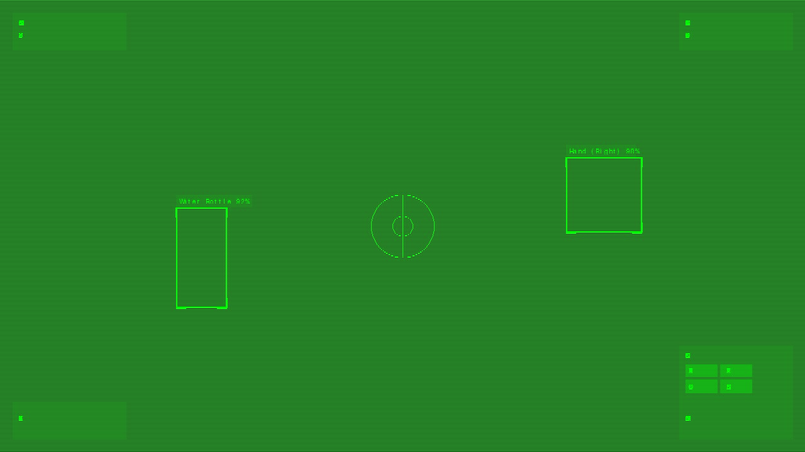

# Fighter Jet HUD Object Detection



## Overview

This application provides a fighter jet-style Heads-Up Display (HUD) interface for real-time object detection using your device's camera. It can detect and track various objects including Rabbit R1 devices, water bottles, measuring tapes, and hands.

Version: 1.0.0

## Features

- **Real-time Object Detection**: Detects and tracks multiple objects simultaneously
- **Fighter Jet HUD Interface**: Displays information in a military-style heads-up display
- **Hand Tracking**: Uses MediaPipe Hands for accurate hand detection and tracking
- **Multiple Object Support**: Detects Rabbit R1 devices, water bottles, measuring tapes, and hands
- **Performance Optimization**: Includes performance mode for lower-end devices
- **Customizable HUD**: Choose between green, amber, and blue color schemes
- **Offline Capability**: Works offline after initial load
- **Cross-Browser Compatibility**: Supports Chrome, Firefox, Safari, and Edge
- **Responsive Design**: Works on desktop and mobile devices

## Quick Start

1. Open `start.html` in your web browser
2. Read the instructions and system requirements
3. Click "LAUNCH APPLICATION" to begin
4. Allow camera access when prompted
5. Position objects in front of your camera to see them detected

## Installation

### Local Installation

1. Download or clone this repository
2. Ensure all files are in their original structure
3. Open `start.html` in a modern web browser

### Web Server Installation

1. Upload all files to your web server
2. Ensure the server supports HTTPS (required for camera access)
3. Navigate to the URL where you uploaded the files
4. Access `start.html` to begin

## Usage Instructions

### Basic Usage

1. **Allow Camera Access**: When prompted, allow the application to access your camera.
2. **Wait for Initialization**: The system will initialize and load the required models.
3. **Position Objects**: Place objects (Rabbit R1, water bottles, measuring tapes) in view of the camera.
4. **View Detections**: Detected objects will be highlighted with bounding boxes and labels.
5. **Use Controls**: Adjust settings using the control panel in the bottom right corner.

### Controls

- **Detection Toggles**: Enable/disable detection for specific object types
- **Confidence Threshold**: Adjust the minimum confidence level for detections
- **HUD Style**: Change the color scheme (Green, Amber, Blue)
- **Performance Mode**: Toggle for improved performance on lower-end devices

### Keyboard Shortcuts

- **P**: Toggle Performance Mode
- **1**: Switch to Green HUD style
- **2**: Switch to Amber HUD style
- **3**: Switch to Blue HUD style
- **H**: Show User Guide

## System Requirements

### Hardware Requirements

- Camera-equipped device (built-in or external webcam)
- Processor: Modern dual-core processor or better
- Memory: 4GB RAM or more recommended
- Graphics: WebGL-capable GPU recommended for optimal performance

### Software Requirements

- **Operating System**: Any OS with a supported browser
- **Browser**: Chrome, Firefox, Safari (v11+), or Edge
- **Internet Connection**: Required for initial load, optional afterward
- **Permissions**: Camera access must be granted

## Browser Compatibility

| Browser | WebRTC | TensorFlow.js | MediaPipe | Notes |
|---------|--------|---------------|-----------|-------|
| Chrome  | ✅ Full | ✅ Full | ✅ Full | Best performance and compatibility |
| Firefox | ✅ Full | ✅ Full | ✅ Good | Good performance, minor differences in WebGL implementation |
| Safari  | ✅ v11+ | ✅ Good | ⚠️ Limited | May have performance issues with complex models |
| Edge    | ✅ Full | ✅ Full | ✅ Good | Similar to Chrome as both use Chromium |

## Technical Details

### Technologies Used

- **TensorFlow.js**: For running machine learning models in the browser
- **COCO-SSD**: Pre-trained model for general object detection
- **MediaPipe Hands**: For hand detection and tracking
- **WebRTC**: For camera access
- **Service Workers**: For offline capability

### File Structure

```
/
├── index.html          # Main application
├── start.html          # Entry point with instructions
├── app.js              # Application logic
├── service-worker.js   # Offline capability
├── manifest.json       # PWA configuration
├── README.md           # Documentation
└── assets/             # Images and icons
    ├── favicon.png
    ├── icon-192.png
    ├── icon-512.png
    └── screenshot1.jpg
```

### Performance Optimization

The application includes several performance optimization techniques:

1. **WebGL Acceleration**: Uses WebGL backend for TensorFlow.js when available
2. **Frame Skipping**: In performance mode, processes fewer frames to reduce load
3. **Model Selection**: Uses lighter models in performance mode
4. **Adaptive Quality**: Adjusts detection quality based on device capabilities
5. **Caching**: Uses service workers to cache resources for offline use

## Troubleshooting

### Camera Access Issues

- **Problem**: Browser shows camera permission prompt but camera doesn't activate
  - **Solution**: Check if another application is using the camera and close it
  
- **Problem**: "Camera access denied" error
  - **Solution**: Reset camera permissions in your browser settings and reload the page
  
- **Problem**: No camera permission prompt appears
  - **Solution**: Ensure you're using HTTPS or localhost, as camera access requires a secure context

### Performance Issues

- **Problem**: Detection is slow or laggy
  - **Solution**: Enable Performance Mode in the controls panel
  
- **Problem**: High CPU/GPU usage
  - **Solution**: Close other tabs and applications, or enable Performance Mode
  
- **Problem**: Application crashes or freezes
  - **Solution**: Try a different browser (Chrome recommended) or restart your device

### Detection Issues

- **Problem**: Objects not being detected
  - **Solution**: Ensure objects are clearly visible and well-lit
  
- **Problem**: False detections or misidentifications
  - **Solution**: Increase the confidence threshold using the slider
  
- **Problem**: Hand detection not working
  - **Solution**: Ensure your browser supports MediaPipe (Chrome works best)

## Known Limitations

- **Lighting Sensitivity**: Detection accuracy may decrease in poor lighting conditions
- **Similar Objects**: May occasionally confuse objects with similar appearances
- **Processing Delay**: Some delay may occur on lower-end devices
- **Battery Usage**: Continuous use may drain battery quickly on mobile devices
- **Safari Limitations**: Hand detection may have limited functionality in Safari

## Future Improvements

- Add support for more object types
- Implement object distance estimation
- Add voice commands
- Improve detection accuracy for Rabbit R1 devices
- Add recording capability
- Implement multi-camera support

## Credits and Acknowledgments

### Technologies

- [TensorFlow.js](https://www.tensorflow.org/js): Machine learning framework for JavaScript
- [MediaPipe](https://mediapipe.dev/): Hand detection and tracking
- [COCO-SSD](https://github.com/tensorflow/tfjs-models/tree/master/coco-ssd): Object detection model

### Research and Inspiration

- Modern fighter jet HUD designs
- Military targeting systems
- Augmented reality interfaces

## License

This project is licensed under the MIT License - see the LICENSE file for details.

## Contact and Support

For issues, questions, or contributions, please open an issue on the project repository or contact the maintainer.